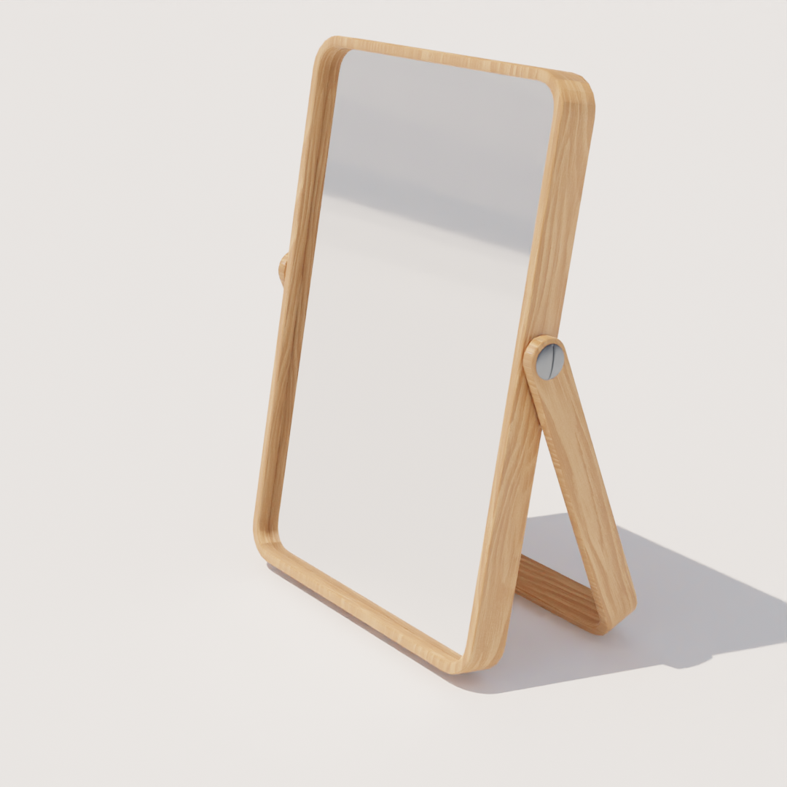

## [Home](./)

---
# 3D Models
---

The following images are renders of models I have created using blender.

I like to practice creating models by modelling real world products. Usually from Ikea, as they're often listed alongside a dimensional drawing.
I also take part in daily 3D challenges, where 3D renders are created in one day using a given promt.

| [Arkelstorp coffee table black](https://www.ikea.com/gb/en/p/arkelstorp-coffee-table-black-30260807/) | [Ravaror shelving unit on castors](https://www.ikea.com/gb/en/p/ravaror-shelving-unit-on-castors-oak-veneer-20454504/) | 
| ---- | ---- |
|  |  |

| [Adde chair black](https://www.ikea.com/gb/en/p/adde-chair-black-90214285/) | [Paerlband tealight holder](https://www.ikea.com/gb/en/p/paerlband-tealight-holder-50348545/) | 
| ---- | ---- |
|  |  | 

| [Ikornnes table mirror](https://www.ikea.com/gb/en/p/ikornnes-table-mirror-ash-00306920/) | [Søborg wood chair](https://www.fredericia.com/products/by-designer-b%C3%B8rge-mogensen/s%C3%B8borg-wood-base-1.aspx?PID=63&catid=6219) | 
| ---- | ---- |
|  |  |
