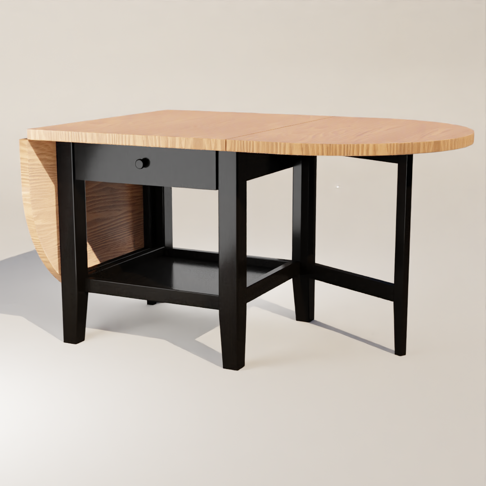
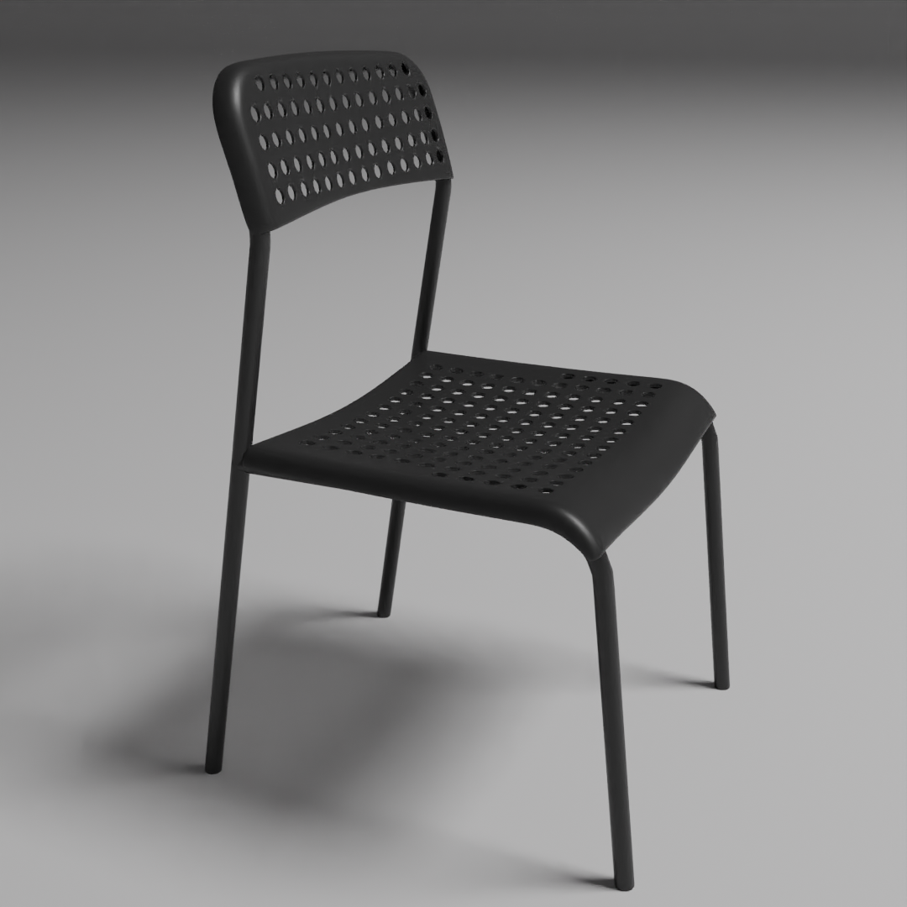

## [Home](./)

---
# 3D Models
---

The following images are renders of models I have created using blender. 

I like to practice creating models by modelling real world products. Usually from Ikea, as they're often listed alongside a dimensional drawing.

---

## [Arkelstorp coffee table black](https://www.ikea.com/gb/en/p/arkelstorp-coffee-table-black-30260807/)

---

## [Ravaror shelving unit on castors](https://www.ikea.com/gb/en/p/ravaror-shelving-unit-on-castors-oak-veneer-20454504/)

---

## [Adde chair black](https://www.ikea.com/gb/en/p/adde-chair-black-90214285/)

---
